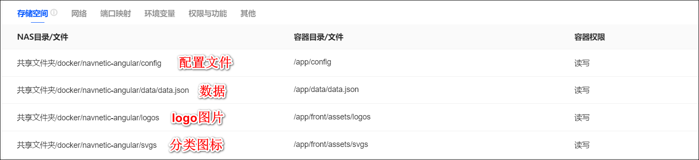

镜像：syueya/navnetic-angular:latest

## 容器部署

1、端口：docker端口是固定的8888，nas 端口可以随便取个未被占用的端口


2、挂载目录: 
- config目录: 用来存放配置文件
- data.json文件: 用来存放数据
- svgs目录: 用来存放分类的svg图标，里面是svg格式的图片，比如a.svg，这个a也就是分类的英文名。
- logos目录: 用来存放网址logo，里面是png格式的图片。比如分类a下网址1的logo为logo1.png，则在logos目录下新建个a文件夹，然后把logo1.png放入。





## compose 文件（待补）

```

```


## 使用

1、打开浏览器，输入nas的ip和端口，端口就是上面配置的nas端口。

2、进入页面后可以看到默认的页面，点击搜索后面的菜单按钮，可以进入编辑页面。


3、编辑页面，可以添加、删除、修改网址，也可以修改分类。


